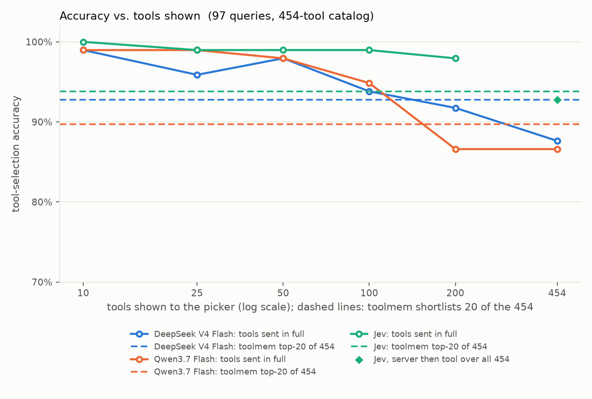
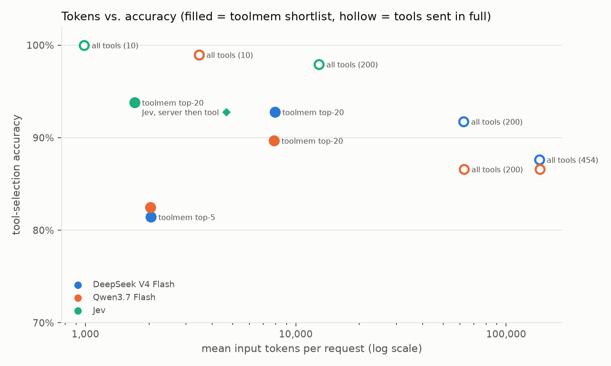

# toolmem benchmark

Does retrieving the top-k tools per query beat putting every tool in the prompt? This directory
holds the data, the harness and the results behind the numbers in the main README. Everything can
be re-run.

## Results

454 real tools from 34 MCP servers, 97 reviewed queries. Pickers: two low-cost LLMs (DeepSeek V4
Flash, Qwen3.7 Flash) and TypeSafe's Jev, a typed-decision model that answers a multiple-choice
question instead of generating text. Run on 2026-09-30.



**Findings.** Every comparison below is a paired test on the same 97 queries; "within noise" means
the difference is not statistically significant at this sample size. All p-values, intervals and
Holm-corrected p-values (20 tests are run, so a lone p just under 0.05 is weak evidence) are in
[`results/stats.md`](results/stats.md), generated by `report.py`.

- **Accuracy falls as more tools are sent.** The LLMs pick an acceptable tool 99% of the time from
  10 tools and 88% (DeepSeek) and 87% (Qwen) from all 454. Both drops are significant (p = 0.003
  and p < 0.001) and survive the correction. The small lists use random distractors, while the full
  catalog contains close siblings, so the drop mixes list size with how similar the other tools are.
- **A toolmem shortlist of 20 matches sending all 454 tools on about 1/18 of the tokens.** DeepSeek
  scores 93% against 88%, and Qwen 90% against 87%. Both differences are within noise (p = 0.18 and
  0.55), so the defensible claim is equal accuracy, not higher. The token saving is not in doubt:
  about 7,900 input tokens per request instead of about 144,000. The dollar saving is smaller than
  that ratio suggests, because OpenRouter served DeepSeek's repeated 454-tool prompt from cache:
  billed, the shortlist cost $0.42 per thousand requests against $2.46 for all tools (about 6x
  cheaper; $0.66 against $11.31 at list price). For Qwen it was $0.26 against $4.65 (about 18x).
- **One of the three pickers leans on the shortlist's order.** toolmem passes the shortlist best
  match first. Shuffled into a random order, the same top-20 lists drop DeepSeek from 93% to 84%
  (8 queries lost, none gained; p = 0.008, 0.11 after correction), slightly below sending all 454
  tools. Qwen (91% shuffled, 90% ordered) and Jev (96% and 94%) are unaffected. Ranking is part of
  what toolmem does, so the ordered result is the fair one, but how much it helps depends on the
  model.
- **The shortlist size matters.** An acceptable tool is in the top 5 for 85% of queries, the top 20
  for 98% and the top 50 for 99%. A top-5 shortlist scores 81 to 82%, worse than the top 20 for
  DeepSeek (p = 0.003) and probably for Qwen (p = 0.065), and not better than sending everything.
  A top-50 shortlist did not help: DeepSeek fell to 87% (p = 0.031, not significant after
  correction) and Qwen stayed at 90%.
- **Rewritten descriptions matter.** Retrieval over LLM-rewritten descriptions beats the original
  descriptions by 15 points on the top-5 shortlist for both models (p = 0.001 each).
- **Jev picks from the shortlist as well as the LLMs, far faster and cheaper.** Jev scores 94% on
  the top-20 shortlist, the same as DeepSeek (93%). It answers in 0.5 seconds on about 1,700 input
  tokens, at $0.07 per thousand requests. DeepSeek with all 454 tools takes 8.6 seconds and $2.46
  per thousand billed ($11.31 at list price). Against sending all tools, Jev's 6 to 7 point lead is
  suggestive but within noise (p = 0.11 and 0.065). The comparison is not like for like: Jev only
  chooses the tool, from each description cut to 400 characters plus its argument names, while
  the LLMs see full schemas and write the arguments too. An agent using Jev still needs an LLM call
  to fill in the arguments.
- **Jev holds up best on long tool lists.** From 200 random tools it scores 98%, against 87% for
  Qwen (p = 0.003, significant after correction) and 92% for DeepSeek (p = 0.07).
- **Jev's confidence can gate decisions.** Its picks at confidence 0.9 or higher cover 58% of
  queries, and every one of them was correct (calibration error 0.074). Handing the less confident
  rest to an LLM with Jev's top 3 was also measured, and it adds nothing: 94% either way.
- **Jev alone can cover the full catalog in two steps.** Jev cannot take 454 options at once (its
  limit is 255, and the catalog is about 144,000 tokens against its 32,000). Picking the server
  first and then the tool scores 93% in 0.8 seconds on about 4,700 tokens; the difference from
  sending all tools to an LLM is within noise.



| model | condition | accuracy | target first | confusable acc. | no tool | cut off | tools/req | input tok/req | list $/1k | billed $/1k | p50 latency |
|---|---|---:|---:|---:|---:|---:|---:|---:|---:|---:|---:|
| DeepSeek V4 Flash | all tools (10) | 99.0% | 97.9% | 100.0% | 0.0% | 0.0% | 10 | 3,461 | 0.30 | 0.30 | 3.9s |
| DeepSeek V4 Flash | all tools (25) | 95.9% | 94.8% | 96.5% | 2.1% | 2.1% | 25 | 8,307 | 0.68 | 0.67 | 3.7s |
| DeepSeek V4 Flash | all tools (50) | 97.9% | 96.9% | 100.0% | 1.0% | 1.0% | 50 | 16,219 | 1.30 | 1.28 | 3.9s |
| DeepSeek V4 Flash | all tools (100) | 93.8% | 92.8% | 100.0% | 1.0% | 0.0% | 100 | 31,436 | 2.50 | 2.45 | 5.3s |
| DeepSeek V4 Flash | all tools (200) | 91.8% | 90.7% | 89.7% | 0.0% | 0.0% | 200 | 62,793 | 4.96 | 4.87 | 6.3s |
| DeepSeek V4 Flash | all tools (454) | 87.6% | 86.6% | 89.7% | 0.0% | 0.0% | 454 | 143,685 | 11.31 | 2.46 | 8.6s |
| DeepSeek V4 Flash | toolmem top-5 | 66.0% | 62.9% | 58.6% | 16.5% | 2.1% | 5 | 2,279 | 0.21 | 0.21 | 4.3s |
| DeepSeek V4 Flash | toolmem top-5 + augmented | 81.4% | 78.3% | 75.9% | 11.3% | 1.0% | 5 | 2,049 | 0.19 | 0.19 | 4.1s |
| DeepSeek V4 Flash | toolmem top-10 + augmented | 86.6% | 84.5% | 82.8% | 4.1% | 2.1% | 10 | 3,989 | 0.35 | 0.34 | 2.4s |
| DeepSeek V4 Flash | toolmem top-20 + augmented | 92.8% | 90.7% | 93.1% | 1.0% | 1.0% | 20 | 7,955 | 0.66 | 0.42 | 2.5s |
| DeepSeek V4 Flash | toolmem top-50 + augmented | 86.6% | 85.6% | 89.7% | 1.0% | 1.0% | 50 | 19,139 | 1.53 | 0.58 | 4.5s |
| DeepSeek V4 Flash | toolmem top-20 + augmented, shuffled | 84.5% | 83.5% | 86.2% | 5.1% | 5.1% | 20 | 7,843 | 0.66 | 0.10 | 10.3s |
| Qwen3.7 Flash | all tools (10) | 99.0% | 97.9% | 96.5% | 1.0% | 0.0% | 10 | 3,465 | 0.13 | 0.13 | 2.8s |
| Qwen3.7 Flash | all tools (25) | 99.0% | 97.9% | 100.0% | 0.0% | 0.0% | 25 | 8,318 | 0.28 | 0.28 | 2.8s |
| Qwen3.7 Flash | all tools (50) | 97.9% | 96.9% | 96.5% | 0.0% | 0.0% | 50 | 16,269 | 0.52 | 0.52 | 3.0s |
| Qwen3.7 Flash | all tools (100) | 94.8% | 93.8% | 93.1% | 2.1% | 1.0% | 100 | 31,552 | 0.98 | 1.88 | 3.9s |
| Qwen3.7 Flash | all tools (200) | 86.6% | 85.6% | 82.8% | 0.0% | 0.0% | 200 | 63,028 | 1.92 | 6.39 | 6.5s |
| Qwen3.7 Flash | all tools (454) | 86.6% | 85.6% | 89.7% | 2.1% | 1.0% | 454 | 144,231 | 4.35 | 4.65 | 2.5s |
| Qwen3.7 Flash | toolmem top-5 | 67.0% | 63.9% | 58.6% | 17.5% | 2.1% | 5 | 2,265 | 0.11 | 0.11 | 2.8s |
| Qwen3.7 Flash | toolmem top-5 + augmented | 82.5% | 79.4% | 75.9% | 10.3% | 0.0% | 5 | 2,038 | 0.10 | 0.10 | 2.8s |
| Qwen3.7 Flash | toolmem top-10 + augmented | 86.6% | 84.5% | 82.8% | 4.1% | 0.0% | 10 | 3,918 | 0.15 | 0.15 | 2.4s |
| Qwen3.7 Flash | toolmem top-20 + augmented | 89.7% | 88.7% | 86.2% | 0.0% | 0.0% | 20 | 7,878 | 0.27 | 0.26 | 2.6s |
| Qwen3.7 Flash | toolmem top-50 + augmented | 89.7% | 88.7% | 89.7% | 0.0% | 0.0% | 50 | 19,045 | 0.60 | 0.65 | 3.1s |
| Qwen3.7 Flash | toolmem top-20 + augmented, shuffled | 90.7% | 89.7% | 93.1% | 1.0% | 0.0% | 20 | 7,878 | 0.27 | 0.27 | 2.8s |
| Jev | all tools (10) | 100.0% | 97.9% | 100.0% | 0.0% | 0.0% | 10 | 987 | 0.04 | 0.04 | 0.5s |
| Jev | all tools (25) | 99.0% | 96.9% | 100.0% | 0.0% | 0.0% | 25 | 1,924 | 0.08 | 0.08 | 0.5s |
| Jev | all tools (50) | 99.0% | 94.8% | 96.5% | 0.0% | 0.0% | 50 | 3,496 | 0.15 | 0.15 | 0.5s |
| Jev | all tools (100) | 99.0% | 94.8% | 96.5% | 0.0% | 0.0% | 100 | 6,631 | 0.28 | 0.28 | 0.5s |
| Jev | all tools (200) | 97.9% | 92.8% | 96.5% | 0.0% | 0.0% | 200 | 12,875 | 0.54 | 0.54 | 0.6s |
| Jev | toolmem top-10 + augmented | 88.7% | 86.6% | 86.2% | 5.1% | 0.0% | 10 | 1,027 | 0.04 | 0.04 | 0.5s |
| Jev | toolmem top-20 + augmented | 93.8% | 92.8% | 93.1% | 2.1% | 0.0% | 20 | 1,713 | 0.07 | 0.07 | 0.5s |
| Jev | toolmem top-50 + augmented | 95.9% | 93.8% | 93.1% | 0.0% | 0.0% | 50 | 3,749 | 0.16 | 0.16 | 0.5s |
| Jev | toolmem top-20 + augmented, shuffled | 95.9% | 92.8% | 96.5% | 1.0% | 0.0% | 20 | 1,713 | 0.07 | 0.07 | 0.5s |
| Jev, server then tool | all tools (454) | 92.8% | 89.7% | 86.2% | 1.0% | 0.0% | 454 | 4,667 | 0.20 | 0.20 | 0.8s |
| Jev, then DeepSeek if unsure | toolmem top-20 + augmented | 93.8% | 92.8% | 93.1% | 0.0% | 0.0% | 20 | 2,514 | 0.16 | 0.16 | 0.5s |
| Jev, then Qwen if unsure | toolmem top-20 + augmented | 93.8% | 92.8% | 89.7% | 1.0% | 0.0% | 20 | 2,454 | 0.11 | 0.11 | 0.7s |

Retrieval only (does the expected tool appear in the top-k?):

| embedder | mode | hit@1 | hit@3 | hit@5 | hit@10 | MRR |
|---|---|---:|---:|---:|---:|---:|
| openai:text-embedding-3-small | keyword | 29.9% | 51.5% | 59.8% | 68.0% | 0.426 |
| openai:text-embedding-3-small | semantic | 36.1% | 57.7% | 65.0% | 82.5% | 0.498 |
| openai:text-embedding-3-small | hybrid | 33.0% | 63.9% | 70.1% | 76.3% | 0.493 |
| openai:text-embedding-3-small | hybrid+aug | 57.7% | 81.4% | 86.6% | 91.8% | 0.706 |

454 tools, 97 queries, embedder `openai:text-embedding-3-small`.

`list $/1k` bills every input token at the listed rate (OpenRouter's listing; Jev charges $0.042
per million input tokens and nothing for output). `billed $/1k` is what OpenRouter actually charged,
after its prompt caching and at whichever upstream served each call; for Jev it equals the list
price. `target first` scores two-step queries as correct only when the first call is the target
tool rather than the second step (the main `accuracy` accepts either; see Scoring). `cut off` is
the share of answers that hit the 1,024-token output limit before calling a tool; they count as
wrong. Latency is the median over the public APIs from one laptop.
The `all tools (N)` rows for N < 454 use a random subset that always contains the expected tool, so
their distractors are mostly unrelated tools; toolmem's retrieved tools are, by construction, the
most similar ones. Paired tests are exact McNemar tests with paired bootstrap intervals.

**Query review.** The 100 drafted queries were reviewed by Claude (Opus 5.5), not by a person, and
against the tool definitions only, without looking at model results. Claude also drafted them, so
this is not an independent review. It dropped 3 (two unrealistic requests and one near-duplicate),
rewrote 2 that did not say which service they meant, and marked 15 where another catalog tool is
equally correct (four interchangeable web-search tools, four page readers, two site mappers, two
browser servers, two local-business searches); those extra tools are listed in `also_accept` and
scored as correct. Before this review the all-tools condition was penalized more by those ambiguous
labels, which made toolmem's lead look significant; after it, the lead is within noise. Every change
is recorded per row in `data/queries.jsonl` (`review_note`, `original_query`), and the pre-review
file is kept as `data/queries.before_review.jsonl`. In the raw drafts (`data/queries.draft.jsonl`),
four connection strings with made-up usernames and passwords are replaced by `<user>:<password>`
so they do not look like leaked credentials; none of those rows is in the reviewed set.

## Method

**Catalog.** `data/tools.json` holds real tool definitions collected from public MCP servers
(`collect_tools.py`, server list in `servers.py`). Each server is started once over stdio and asked
for `tools/list`; nothing is executed. Names are prefixed with the server (`github__create_issue`)
because several servers ship a tool called `search`. Schemas are passed to the model exactly as the
server published them, minus a `$schema` key.

**Queries.** `data/queries.jsonl` holds one JSON row per case: `query`, `expected` (tool names),
`server`, `kind` (`direct`, `confusable` or `multi`) and `status` (`ok` or `dropped`). Review
fields: `also_accept` (other tools that are equally correct, scored as correct but not forced into
the random subsets), `review_note` and, for rewritten rows, `original_query`. A row's line number
fixes its random subset, so dropped rows stay in the file. Drafts came from
`draft_queries.py`, which shows Claude the target tool and its closest siblings from the same
server and asks for user-style requests that avoid the tool's own wording, including one request
designed to be confused with a sibling. A balanced 100 of the 393 drafts were selected and reviewed
(see Query review above); `check_queries.py` rejects duplicates, unknown tools and queries that copy most of the tool text. The drafter (Claude)
and the augmenter (DeepSeek) are different model families, so the augmented descriptions cannot
have been tuned to the queries.

**Conditions.** For every query the model is asked to call the single best tool.

| condition | what the model sees |
|---|---|
| `all@N` | N tools, a seeded random subset that always contains the expected tool (N = full catalog for `all@all`) |
| `toolmem@5` | the 5 tools toolmem's hybrid retrieval (embeddings + BM25, reciprocal rank fusion) returns for the query |
| `toolmem_aug@K` | same, but retrieval runs over LLM-augmented descriptions; the schemas the model sees are unchanged. Run at K = 5, 10, 20 and 50 |
| `toolmem_aug_shuffled@K` | the same shortlist in a seeded random order instead of best match first. Run at K = 20 |

**Jev.** For Jev the tool list becomes one multiple-choice question: each tool is an option keyed
by its name with its description as the criteria text, plus a `none` option. The Jev server-then-tool
run asks two questions per query: which server, then which of that server's tools.

**Scoring.** A request is correct when the first tool call names an expected tool or one listed in
`also_accept`. For two-step (`multi`) queries either step counts, which makes them easier than
single-tool queries; the `target first` column scores them strictly and runs about a point lower
everywhere, which changes no finding. "No tool" means the model answered in text. For the toolmem conditions, `retrieval
recall` is the share of queries where an acceptable tool was among the K retrieved, which is the
ceiling for their accuracy.

**Models.** Two low-cost models through OpenRouter: DeepSeek V4 Flash (`deepseek/deepseek-v4-flash`)
and Qwen3.7 Flash (`qwen/qwen3.7-flash`), both with `tool_choice: auto` and parallel tool calls off.
Tokens come from the API's usage fields. List cost uses OpenRouter's listed prices and billed cost
uses the cost OpenRouter reports per call; both are recorded in `summary.json`. The harness also supports Claude through the `anthropic` SDK
(`--provider anthropic:claude-sonnet-5-5`) for anyone who wants to add a frontier-model run.

## Re-run

```bash
uv pip install -e ".[bench]"
export OPENROUTER_API_KEY=... OPENAI_API_KEY=... TYPESAFE_API_KEY=...   # ANTHROPIC_API_KEY to redraft queries

ALL=all@10,all@25,all@50,all@100,all@200,all@all,toolmem@5,toolmem_aug@5,toolmem_aug@10,toolmem_aug@20,toolmem_aug@50,toolmem_aug_shuffled@20
JEV=all@10,all@25,all@50,all@100,all@200,toolmem_aug@10,toolmem_aug@20,toolmem_aug@50,toolmem_aug_shuffled@20

python benchmark/collect_tools.py                     # refresh data/tools.json (optional)
python benchmark/draft_queries.py --n-tools 80        # redraft queries (optional, about $1 on Claude Opus 5.5)
python benchmark/check_queries.py                     # lint data/queries.jsonl

# Always dry-run first: it prints new calls and projected spend and makes no model calls.
python benchmark/run.py --provider openrouter:deepseek/deepseek-v4-flash --conditions $ALL --dry-run
python benchmark/run.py --provider openrouter:deepseek/deepseek-v4-flash --conditions $ALL --budget-usd 2
python benchmark/run.py --provider openrouter:qwen/qwen3.7-flash --conditions $ALL --budget-usd 2
python benchmark/run.py --provider jev --conditions $JEV --budget-usd 0.5           # Jev picks
python benchmark/run.py --provider jevroute --conditions all@all --budget-usd 0.1   # Jev: server, then tool
python benchmark/run.py --provider cascade:openrouter:deepseek/deepseek-v4-flash --conditions toolmem_aug@20 --budget-usd 0.1
python benchmark/report.py                            # table, stats.md and charts in results/
```

**Cost.** A full re-run from scratch costs about $3: roughly $1.30 for DeepSeek and $1.50 for Qwen
(OpenRouter billed Qwen at about twice its listed price), under $0.30 for all Jev runs, and a few
cents for rewriting descriptions and embeddings. Redrafting queries adds about $1. `--budget-usd`
stops issuing new calls once real spend passes the cap.

Model responses are cached in `benchmark/.cache.sqlite`, keyed by model, condition, tool list and
query. The cache is not committed, so your first run pays in full; after that, an interrupted run
resumes and re-running the same configuration is free. Use `--cache-only` to rebuild results files
from the cache without any model calls, `--fresh` to force new calls, `--limit 20` for a smoke test,
and `--provider fake --embedder hashing` for a fully offline run.

## Caveats

- One catalog, one query set, one prompt. Different tool descriptions or system prompts move the
  numbers; the harness is here so you can measure your own catalog.
- Queries were drafted and reviewed by Claude, not by a person, and are not logged production
  traffic.
- 97 queries give an error margin of several points per setup, so gaps of a few points are within
  noise. Each finding says whether its difference is significant.
- The `all@N` subsets are random, so a small N can be easier or harder than the full catalog
  depending on which distractors were drawn. The seed is fixed and recorded in `summary.json`.
- Latency is measured from a laptop over the public API and includes queueing and prompt caching on
  the provider side; Qwen answered faster with all 454 tools (2.5 s) than with 200 (6.5 s). Treat
  latency as rough.
- Each setup was run once, at the providers' default temperature, without pinning an OpenRouter
  upstream. Run-to-run variation was not measured and may account for some gaps of a few points,
  such as DeepSeek's top-50 result.
- toolmem passes its shortlist best match first, while the full list is in alphabetical order. The
  `toolmem_aug_shuffled@20` condition measures how much the order matters (see Findings).
- The queries (by Claude) and the rewritten descriptions (by DeepSeek) are both LLM-written from the
  same tool text. Different model families rule out tuning one to the other, but real user requests
  may match the rewritten descriptions less well than these queries do.
